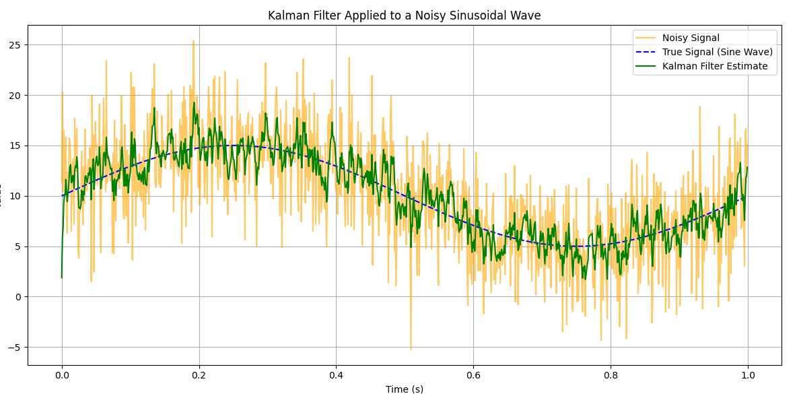
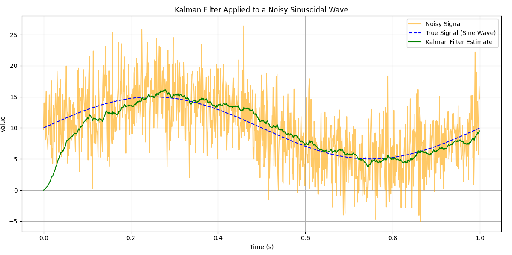

# LB7_Kalman

Этот проект посвящён реализации модели фильтра Калмана для отслеживания изменений состояния системы с учётом различных уровней шума.

---

## Описание компонентов

### 1. Матрица перехода состояния
Для данного исследования используется единичная матрица перехода состояния, так как модель предполагает сохранение текущего значения без внесения изменений.

---

### 2. Матрица наблюдений (H)
Матрица наблюдений также является единичной, что указывает на прямое отображение наблюдений на состояние системы без дополнительных преобразований.

---

### 3. Ковариация измерительного шума
Ковариация шума измерений установлена на уровне 1000, что учитывает высокий уровень неопределённости в данных измерений.

---

### 4. Начальное значение оценки состояния
Начальное значение оценки состояния задаётся как 10, что обеспечивает модели стартовую базу для дальнейших вычислений.

---

### 5. Период исследования
Время исследования установлено равным 4 секундам, что считается оптимальным для анализа динамики модели и сбора данных.

---

### 6. Новое значение ковариации измерительного шума
Для тестирования устойчивости модели уровень ковариации измерительного шума увеличен до 10000, что позволяет проверить её работу в условиях повышенного уровня шумов.

---

### 7. Ковариация шума процесса
Ковариация шума процесса установлена на уровне 20, что отражает способность модели учитывать случайные возмущения в системе.

---

### 8. Амплитуда сигнала
Амплитуда сигнала установлена на уровне 10, что задаёт допустимый уровень колебаний модели в процессе работы.

---

Проект демонстрирует работу фильтра Калмана в условиях различных уровней шума и начальных параметров. Использование адаптивных настроек позволяет оценить поведение системы в динамике и улучшить точность оценки состояния.